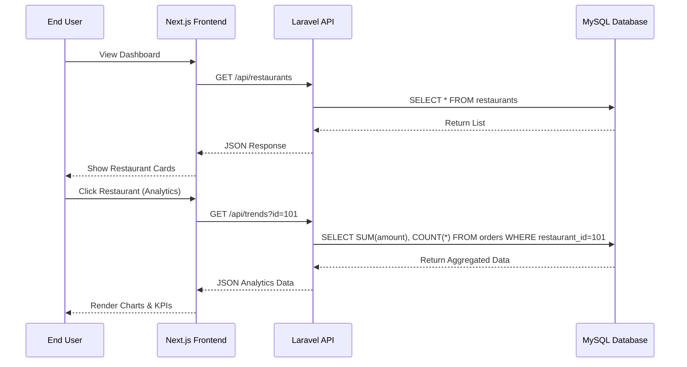

# System Architecture

## Overview
Kitchen Spurs is a full-stack restaurant analytics dashboard designed to process and visualize order data efficiently. It follows a decoupled client-server architecture.

### High-Level Design

## Component Breakdown

### Frontend (Next.js 15)
*   **Framework:** Next.js with App Router for server-side rendering and static generation.
*   **State Management:** React Hooks (`useState`, `useEffect`) for managing local component state and filters.
*   **Data Fetching:** Axios for HTTP requests to the backend API.
*   **Styling:** Tailwind CSS for a modern, responsive design system.
*   **Visualization:** Recharts for rendering interactive line charts and bar graphs.

### Backend (Laravel 12)
*   **API Layer:** RESTful controllers (`RestaurantController`, `AnalyticsController`) handling HTTP requests.
*   **Service Layer:** Business logic for aggregating data (e.g., calculating peak hours).
*   **Data Access Layer:** Eloquent ORM and Query Builder for interacting with the database.
*   **Database:** MySQL 8.0 with optimized indexing strategies.

### Database Schema
*   **Restaurants Table:** Stores restaurant profiles (`id`, `name`, `location`, `cuisine`).
*   **Orders Table:** Stores transactional data (`id`, `restaurant_id`, `amount`, `timestamp`).
    *   *Relationship:* One-to-Many (One Restaurant has many Orders).

## Key Design Decisions
1.  **Server-Side Aggregation:** Calculations for daily revenue and peak hours are performed in the database using SQL aggregation functions (`SUM`, `COUNT`, `GROUP BY`) rather than fetching raw data into PHP memory. This ensures scalability.
2.  **Stateless API:** The backend is stateless, relying on REST principles, making it easy to scale horizontally if needed.
3.  **Client-Side Caching (Potential):** The frontend structure supports easy integration with SWR or React Query for caching API responses.
